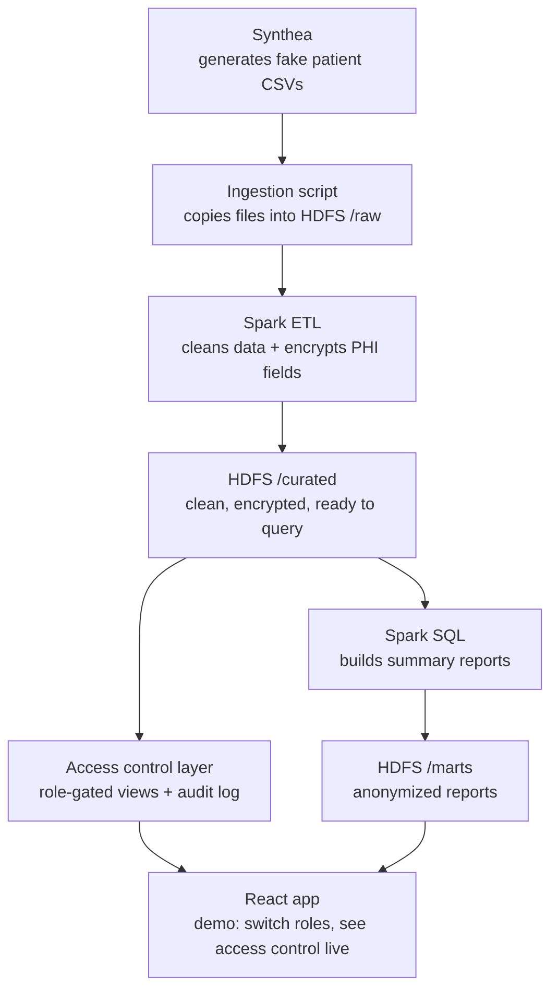
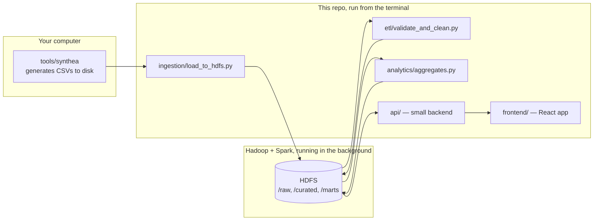

# Secure Healthcare Big Data Management System

A pipeline that takes patient data, stores it safely, and controls who can see what.

We use **Synthea** to generate fake (but realistic) patient records, **HDFS** to store the data, **Spark** to clean and process it, and a security layer we build ourselves to encrypt sensitive fields and control access. A small **React app** shows that access control working live.

---

## 1. The big picture

Think of it like a hospital records room, split into stages:

1. **Synthea** generates fake patient data (CSV files) — this happens on our own computer, not inside the pipeline.
2. **Ingestion** copies that data into HDFS, untouched, with a receipt (a manifest) proving what was loaded.
3. **Spark ETL** cleans the data, fixes formatting, removes duplicates, and **encrypts sensitive fields** (like name, SSN, address) before saving it.
4. **Spark SQL** builds summary reports (like "how many flu cases this month") from the cleaned data — these reports never contain raw patient identity.
5. **Access control** decides who can see decrypted patient data (a "clinician" role) versus only summaries (an "analyst" role) — and logs every single access attempt.
6. **The React app** is a demo screen showing steps 5 and 6 happening live — switch roles, watch what's visible change, watch the log fill up.



---

## 2. Where things actually run

Nothing here is a hosted website. Everything is either a terminal command you run yourself, or infrastructure (HDFS, Spark) that runs in the background on your machine.



**In plain terms:**
- HDFS and Spark are software you install once and leave running (`start-dfs.sh`) — they're not part of the repo, they're infrastructure the repo's scripts talk to.
- Everything under `ingestion/`, `etl/`, `analytics/` runs as a one-off terminal command (`python ...` or `spark-submit ...`).
- `api/` and `frontend/` run continuously while you're demoing — one terminal each.
- Synthea lives in `tools/synthea` (a separate clone, not our code) and is run once to generate data.

---

## 3. Repo structure

```
secure-healthcare-bigdata-pipeline/
├── tools/
│   └── synthea/              # cloned separately — generates fake patient CSVs
│
├── shared/
│   └── config/
│       ├── phi_fields.py     # list of which columns are sensitive (PHI)
│       └── roles.py          # which role can see which columns
│
├── ingestion/
│   ├── load_to_hdfs.py       # copies Synthea's CSVs into HDFS /raw
│   └── manifest.py           # writes the "receipt" for each load
│
├── etl/
│   ├── validate_and_clean.py # Spark job: cleans + encrypts, writes to /curated
│   └── schemas.py            # expected structure for each table
│
├── security/
│   ├── encryption.py         # encrypt/decrypt PHI fields
│   ├── access_control.py     # role-based views over /curated
│   └── audit_log.py          # logs every access attempt
│
├── analytics/
│   ├── aggregates.py         # Spark SQL: builds summary reports in /marts
│   └── README.md             # what each report answers
│
├── api/                       # small backend (FastAPI or Express)
│   └── ...                    # wraps access_control.py + audit_log.py for the frontend
│
├── frontend/                  # React app
│   └── ...                    # role switcher, live data view, audit log panel
│
├── scripts/
│   └── run_pipeline.sh       # runs ingestion → ETL → aggregates in order
│
├── .env.example               # HDFS_NAMENODE, ENCRYPTION_KEY, SPARK_MASTER
└── README.md                  # this file
```

---

## 4. HDFS storage layout

`/raw`, `/curated`, and `/marts` don't live in this repo — they live inside HDFS, which is a separate storage layer running on the machine where you started Hadoop.

```
HDFS
├── /raw
│   ├── 2026-08-25/
│   │   ├── patients.csv
│   │   ├── encounters.csv
│   │   ├── ...
│   │   └── _manifest.json     # row counts + checksums for this load
│   └── _rejects/
│       └── 2026-08-25/
│           └── patients/       # rows that failed validation, with a reason
│
├── /curated
│   └── patients/
│       └── year=2026/month=08/
│           └── part-00000.parquet   # cleaned, PHI columns encrypted
│
└── /marts
    ├── condition_prevalence/2026-08-25/
    ├── encounter_volume/2026-08-25/
    └── medication_trend/2026-08-25/
```

You browse it with `hdfs dfs -ls /raw`, not with your regular file explorer — it's a different file system layered on top of your normal one.

---

## 5. Running it end to end

```bash
# 0. One-time setup: install Hadoop + Spark, then start HDFS
start-dfs.sh

# 1. Generate fake patient data
cd tools/synthea && ./run_synthea -p 1000

# 2. Load it into HDFS
python ingestion/load_to_hdfs.py --date 2026-08-25

# 3. Clean + encrypt it
spark-submit etl/validate_and_clean.py --date 2026-08-25

# 4. Build summary reports
spark-submit analytics/aggregates.py --date 2026-08-25

# 5. Start the demo (two terminals)
uvicorn api.main:app --reload        # terminal 1
cd frontend && npm start             # terminal 2
```

---

## Getting started
See [SETUP.md](./SETUP.md) for environment setup (Linux/macOS/Windows).

---

## 6. Team split (suggested)

| Area | Tasks | Depends on |
|---|---|---|
| Setup | TASK-0 | — |
| Data generation + loading | TASK-1 | TASK-0 |
| Spark cleaning | TASK-2 | TASK-0, TASK-1 |
| Encryption | TASK-3 | TASK-0 |
| Access control + logging | TASK-4 | TASK-3 |
| Summary reports | TASK-5 | TASK-2 |
| Integration + demo prep | TASK-6 | everything |
| Frontend (React + API) | TASK-7 | TASK-4, TASK-5 |

Full detail on every task — steps, what "done" looks like, files to create — is in the requirements doc.